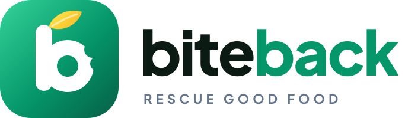

<p align="center"></p>

# BiteBack: Reduce Food Waste

BiteBack is a marketplace where restaurants in greater Seattle sell food that would otherwise be thrown away (wrong orders, delayed deliveries, orders nobody picked up, end-of-day surplus) at a discount they choose. Customers reserve it online and pick it up in person.

## How it works

**Customers**
1. Sign up free with an **email, user name and password**.
2. Browse deals nearby as a **list** or on an **interactive map** (zoom in/out, click a pin to see that restaurant's deals and order). Search by any city or ZIP code in King, Pierce, Thurston, Snohomish and Kitsap counties (Seattle, Des Moines, Kent, Federal Way, Tacoma, Fife, Olympia, Lacey, Puyallup, Everett, Bremerton and more), or use your location. Filter by dietary tags and distance, and sort by nearest, biggest discount, lowest price or ending soon. Each deal shows the restaurant, address, map link, why it's discounted, dietary tags, original vs. discounted price, quantity left and the pickup window.
3. Choose a quantity. **Customers can't order more than the restaurant made available.** Then review the total before ordering: **food price + 5% service fee + WA sales tax = total**.
4. Pay by debit/credit card. Cards can be **saved for future use** (managed on the Account page).
5. A confetti "Congratulations!" screen shows the **4-digit PIN**. A hold is placed on the card for the total. **The card is only charged when the order is picked up.**

**Restaurants**
1. Sign up as a restaurant (the same form, "I'm a restaurant" tab).
2. Build your **Menu** with dish name, price, dietary tags and a **photo** (photos are resized in the browser before upload).
3. Post surplus food by **choosing a dish from a drop-down of your menu**, then set the reason, **your discount %**, the quantity available and a **discard timer** (30 min, 1, 1½, 2, 3 or 4 hours, or a custom number of minutes). The food is available immediately.
   - Customers see a live countdown, amber in the last 15 minutes.
   - When the timer runs out, the offer disappears and the dashboard shows "🗑️ Discard N unsold".
   - Use **+30m / +1h** to extend a running timer, or pause, edit or end the offer at any time.
4. **New-order bell:** keep the dashboard open and it rings a counter bell ("ding-ding") and pops up the order the moment a customer orders. It uses a live Server-Sent Events connection. Browsers only allow sound after you click the page once, and the dashboard shows a reminder until you do. Sound can be switched off with the 🔔 button.
5. When a customer arrives, enter their PIN under **Verify pickup**, check the order, then press **Hand over food & charge**. That captures the payment.
6. The dashboard shows orders awaiting pickup, order history and meals rescued/sales.

**Receipts:** every order has a full receipt showing:
- the BiteBack logo and receipt number
- the restaurant's name, address and phone, and the customer
- the item, quantity, ~~original price~~, discount % and new price
- savings, service fee, WA sales tax and total
- the card used, payment status, amount charged and transaction ID

Customers can view it (My orders → View receipt), **print** it, or **download it as a PDF**.

**Daily report (restaurants):** Dashboard → 📄 Daily report. Pick a day to see food sales, orders picked up, meals rescued, discounts given, sales tax collected and total charged, plus every order. **Print** it, or download it as **PDF** or **CSV** (opens in Excel/Sheets). Days use Pacific Time (`TIME_ZONE`).

**Automatic cleanup:** unfinished checkouts are released after 15 minutes. Orders not picked up within 10 minutes after the discard timer ends are released **without charging the customer**. Expired offers are closed.

## Owner / admin console (`/admin/`)

Admin accounts can't be created through sign-up. Create yours on the server:

```bash
npm run create-admin -- --email you@yourcompany.com --username owner
# asks for a password (or set ADMIN_PASSWORD); run again to reset the password
```

Log in at `/login` and you land on the console:

| Tab | What you can do |
|---|---|
| **Overview** | For any date range: BiteBack revenue (service fees), total charged, restaurant food sales, sales tax, orders, meals rescued, customer savings and refunds. Also a daily chart (with a table view), what's happening right now, and the top restaurants. |
| **Restaurants** | Search and filter. **Approve** new restaurants (their offers stay hidden until approved), and **suspend** or reinstate restaurants with a note. |
| **Customers** | Customers, restaurant owners and admins, with orders, spend, **platform credit balance**, no-shows and when they accepted the terms. **+ Credit** issues goodwill credit. **Suspend** (signs them out and blocks login) or reactivate. |
| **Orders** | Every order, with search, status and date filters. **Cancel** an open order (releases the card hold). **Refund** by 10/25/50/75/100% or a manual amount, either to the **original form of payment** (shown, e.g. VISA •••• 4242 + credit) or as **BiteBack platform credit**. Download the receipt PDF and export CSV. |
| **Live offers** | Everything currently listed. **Remove** anything inappropriate. |
| **Payouts** | Each restaurant's bank account on file, what it has earned, what's been paid, and the balance owed. **Record payout** fills in a locked **invoice number** (`INV-20260928-000001`) and locked **bank/transaction details** (masked bank account plus a transaction ID). You can reveal the full account numbers to send the transfer; every reveal is logged. History and CSV export. |
| **Sales tax** | Taxable sales and tax collected by city, ZIP and rate for your Washington excise tax return, with CSV export. |
| **Settings** | Customer service fee %, default sales tax for new restaurants, and whether new restaurants need approval. |
| **Audit log** | Every admin action: approvals, suspensions, refunds, payouts and settings changes, with who did it and when. |

Suspended restaurants see a banner in their portal and can't post offers, but they can still verify pickups for existing orders. Pending restaurants can set up their menu while they wait for approval (`REQUIRE_RESTAURANT_APPROVAL`, on by default).

### Refunds, platform credit and who pays

| Refund method | Customer gets | Restaurant | BiteBack (you) |
|---|---|---|---|
| **Original form of payment** | Money back to their card. If they paid with credit, that part goes back to their credit balance. | Receives **nothing** for the refunded share (deducted from payouts). | Gives up the service fee on the refunded share. |
| **Platform credit** | Credit on their BiteBack account. | Keeps its **full** payment. | **Pays for the credit.** |

- **Using credit:** customers see their balance in the header ("🎁 $X credit") and on the Account page, with the full history.
- **At checkout:** they choose how much credit to apply, and the card covers the rest (at least $0.50). If credit covers the whole order, no card is needed.
- **Unused credit:** credit on an order that's cancelled or not picked up goes back to their balance.
- **Restaurants:** when a customer pays with credit, the restaurant still earns the full food subtotal.

**Bank accounts:** restaurants add their payout account in their portal (**Payouts** tab). Routing and account numbers are validated, including the routing checksum, then encrypted with AES-256-GCM and shown back only as the last 4 digits. In production, set `DATA_ENCRYPTION_KEY`. Without it, a key file is created at `data/encryption.key`: back it up, because losing it means the stored bank numbers can't be read.

## Terms, agreement and privacy

Sign-up has two steps. First the form is checked, then the **Customer Terms of Service + Privacy Policy** (customers) or the **Restaurant Partner Agreement + Privacy Policy** (restaurants) open in a dialog.

- **Accepting:** the person must scroll to the end and tick "I have read and agree" before **Accept & create account** is enabled.
- **Declining:** creates nothing.
- **Server check:** the server refuses to create an account unless the current version of every required document is accepted.
- **Record kept:** each acceptance is stored in `terms_acceptances` with the document, version, time, IP address and browser.
- **Public pages:** the documents are at `/legal/customer-terms`, `/legal/restaurant-agreement` and `/legal/privacy` (printable).
- **Updating the terms:** edit `server/legal/documents.js` and change `VERSION`. Every signed-in user is then asked to accept the new version, and declining signs them out.
- **Company details:** set `LEGAL_ENTITY_NAME`, `SUPPORT_EMAIL` and `LEGAL_ADDRESS`.

> The documents were written for a Washington State food marketplace, but they are not legal advice. Have a Washington-licensed attorney review them before launch. In particular, check the marketplace-facilitator tax wording, the insurance minimum and the dispute-resolution clause. The Partner Agreement promises weekly payouts through the payment processor, so Stripe Connect payouts must be built before launch.

## Payments: authorize now, charge at pickup

Charging "at pickup" is done with a card **authorization** (hold) at checkout and a **capture** when the restaurant enters the PIN. This is the same approach hotels and gas stations use. It guarantees the funds are there without charging anyone for food they never collected. Customer cancellations and no-shows void the hold.

- **Mock mode (default):** runs with no setup. No real money moves. Test card `4242 4242 4242 4242` (any future expiry, any CVC). `4000 0000 0000 0002` simulates a decline.
- **Stripe mode:** set `STRIPE_SECRET_KEY` and `STRIPE_PUBLISHABLE_KEY` in `.env`. Card numbers are entered into Stripe Elements and go directly to Stripe; they never touch BiteBack servers, which keeps you in the lightest PCI scope (SAQ A). Saved cards are Stripe PaymentMethods attached to a Stripe Customer. 3-D Secure challenges are handled automatically.

> Card holds normally last about 7 days, which is well beyond BiteBack's same-day pickup windows.

## Pricing & tax

| Line | Calculation |
|---|---|
| Food | original price × (1 − discount %) × quantity |
| Service fee | 5% of food (`SERVICE_FEE_BPS=500`) |
| WA sales tax | restaurant's rate × food (default 10.35%, the City of Seattle rate) |
| **Total** | food + service fee + tax |

Each restaurant sets its own combined state + local rate in **Profile & tax**, because WA rates differ by city (look one up at the [WA DOR rate lookup](https://dor.wa.gov/taxes-rates/sales-use-tax-rates/lookup-tax-rate)). Whether the service fee is taxable is controlled by `TAX_SERVICE_FEE`. Money is stored as integer cents, and every order stores a copy of its price breakdown.

## Running it

Requires **Node.js 22.13+** (uses the built-in `node:sqlite`; no database server needed).

```bash
npm install
cp .env.example .env     # optional
npm run seed             # optional: demo restaurants & deals around Seattle
npm start                # http://localhost:3000
npm test                 # API + pricing tests
```

Demo logins after seeding (password `BiteBack123`). The seed also adds two weeks of sample completed orders so the admin dashboard has data:
- Owner/admin: `admin` (demo only; create your real admin with `npm run create-admin`)
- Customer: `demo`
- Restaurants (all fictional) in Seattle and the Eastside: `harborpho`, `ballardbread`, `caphilltacos`, `fremontpizza`, `bellevuecurry`, `redmondpoke`, `kirklandsushi`
- Restaurants around the region: `desmoinesfish` (Des Moines), `kentteriyaki` and `kentpupusas` (Kent), `fedwaykbbq` and `fedwaybakery` (Federal Way), `tacomathai`, `tacomaburger` and `tacomatamales` (Tacoma), `fifepho` (Fife), `olympiacafe` and `olympiapizza` (Olympia), `laceycurry` (Lacey), `puyallupdeli` (Puyallup), `auburnnoodle` (Auburn), `rentontacos` (Renton), `burienmed` (Burien), `tukwilasushi` (Tukwila), `lakewoodsoul` (Lakewood), `everettbbq` (Everett), `lynnwoodgreens` (Lynnwood), `bremertonchowder` (Bremerton), `issaquahbakehouse` (Issaquah)

**Food photos:** restaurants upload real photos in the Menu tab (dish → Edit → Choose photo). The demo dishes start without photos. To give them photos, put JPEGs you have the rights to in `public/assets/demo-food/`, named as in the `MENU` list in `server/seed.js` (e.g. `beef-pho.jpg`), then re-run `npm run seed` on a fresh database. Uploaded photos are stored in `data/uploads/` (set `UPLOADS_DIR` to change this). Back that folder up along with the database.

**Map & service area:**
- **Tiles:** maps use Leaflet with OpenStreetMap tiles (`MAP_TILE_URL`, `MAP_ATTRIBUTION`). OSM's free tile server is fine for development and light traffic. For a real launch, switch to a tile provider such as MapTiler, Stadia Maps or Mapbox, and set `MAP_DARK_FILTER=false` if you use a dark style.
- **Restaurant pins:** a restaurant is pinned at its ZIP code's center when it signs up. The owner can drag the pin to the exact spot under Profile & tax.
- **ZIP data:** `server/data/puget-sound-zips.json` lists 186 ZIP codes. ZIP list from USPS (via the MIT-licensed `zipcodes` package); coordinates © GeoNames (geonames.org), CC BY 4.0.

## Project layout

```
server/
  index.js            start server + background cleanup every minute
  app.js              Express app, security headers, CSRF guard
  db.js               SQLite schema
  auth.js             scrypt password hashing, cookie sessions, rate limiting
  pricing.js          fee & tax math (integer cents)
  orders.js           order lifecycle: reserve → authorize → pickup/capture | cancel/expire → void
  payments/           stripe.js (real) and mock.js (development)
  routes/             auth, customer (offers/cards/orders), restaurant (offers/pickup/stats)
public/               static site (HTML/CSS/vanilla JS modules), logo in public/assets/
test/                 node:test suites
```

## Security notes

- Passwords are hashed with scrypt. Sessions are random tokens (stored hashed) in `HttpOnly`, `SameSite=Lax` cookies. Set `COOKIE_SECURE=true` behind HTTPS.
- Login attempts and PIN lookups are rate-limited (a 4-digit PIN could otherwise be brute-forced). PINs are unique among a restaurant's open orders, and only the customer who placed the order can see the PIN.
- A strict Content-Security-Policy is set, all state-changing API calls require a custom header (CSRF protection), and all rendered text is HTML-escaped.

## Before launching for real

- **Restaurant payouts:** right now all charges land in the BiteBack Stripe account. Use **Stripe Connect** (destination charges with `application_fee_amount`) to pay restaurants their food sales automatically.
- **Tax:** confirm with a WA CPA how marketplace-facilitator rules apply to you (who collects and remits the tax, and whether the service fee is taxable).
- **Legal:** terms of service, a privacy policy and a food-safety/liability disclaimer (see the federal Bill Emerson Good Samaritan Food Donation Act and the 2023 Food Donation Improvement Act). Also confirm local health-department guidance on reselling surplus prepared food.
- **Operations:** email verification and password reset (needs an email provider), HTTPS hosting, database backups, and a way to reach support.
